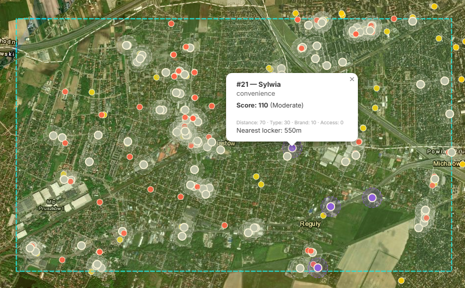

# InPost Neviim — The Parcel Prophet 

## Author

- **Name:** Illia Datsiuk
- **Email:** elijah@datapeice.me

## Overview

InPost Neviim is an automated parcel locker distribution platform designed for optimizing network expansion. It analyzes real-time geographic data to identify high-potential sites while accounting for competitor proximity and local infrastructure density. The system solves the problem of manual site selection by providing an algorithmic, data-driven recommendation engine.

## Live Demo

**🚀 [neviim.datapeice.me](https://neviim.datapeice.me/)**



## Overview
- **3-Stage Selection Logic**: The system first looks for high-traffic commercial POIs (supermarkets, malls). If none are found, it falls back to public/social infrastructure. In low-density "Rural Areas", it automatically calculates the geometric center (centroid) of existing residential buildings to find the heart of the community.
- **Competitor Penalty Scoring**: A sophisticated scoring algorithm that penalizes candidate sites based on their proximity to competitors (DHL, DPD, etc.), allowing users to adjust the "Competitor Weight" in real-time.
- **Asynchronous Pipeline**: The backend uses an asynchronous worker pattern to handle heavy Overpass API requests without blocking the main thread, providing partial updates to the client.

## Technologies

- **Backend**: Java 17, Spring Boot 3, Spring WebSocket (STOMP), Overpass API (OSM).
- **Frontend**: React 18, Leaflet.js (Map Engine), SockJS (WebSocket Client), CSS3 Cinematic Animations.
- **Build Tools**: Maven, Vite.

## How to run

### Prerequisites
- **Java 17** or higher
- **Node.js 18** or higher
- **Maven** (optional, wrapper included)

### Build & run

1. **Clone the repository**:
```bash
git clone https://github.com/datapeice/neviim.git
cd neviim
```

2. **Run**:
```bash
docker compose up -d --build
```
*The app will be available at `http://localhost:5173`*

## What I would do with more time

- **Demand Heatmaps**: Integrate historical parcel delivery data to create a demand-density heatmap overlay.
- **Simulation**: Add a "Courier Path" simulator to see how a new locker affects daily delivery routes stands at population density at each town/village/city and calculate average delivery time and cost.

## AI usage

I used **Antigravity (from Google DeepMind)** as a pair-programming partner. AI assisted with:
- Implementing the real-time WebSocket streaming logic.
- Designing the "Rural Mode" centroid calculation algorithm.
- Crafting complex CSS3 animations for the "cinematic" UI features.
- Generating the project's visual assets and branding elements.
*All AI-generated code was manually reviewed, debugged (especially Backend for security reasons), and adapted to fit the specific business logic of InPost.*

## Anything else?

### 🤡 The "Prophet" Easter Egg
In the spirit of "The Parcel Prophet" branding, I added a hidden feature:
- **The "Destroy" Button**: When viewing a competitor (DHL/DPD) marker, a red "DESTROY!" button appears. Clicking it triggers a cinematic 10-second sequence where a custom-designed UAV (drone) performs a target-lock orbit and a terminal dive, resulting in a fiery explosion. 
- **Context**: This is a satirical take on "aggressive market competition" and serves as a demonstration of complex CSS animation synchronization and state management. 
- *Disclaimer: No competitors or fluffy animals were harmed. It's a joke! 🐾*
